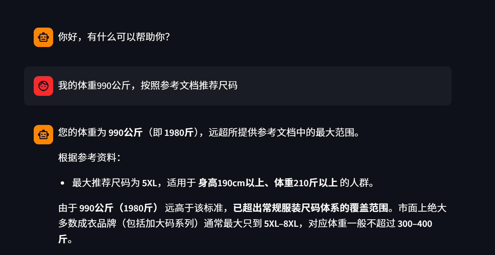

# KnowledgeBase-RAG-LLM-System

## A local knowledge base upload and **RAG** Q&A learning project based on **Streamlit**
Suitable as an entry-level hands-on project for local knowledge base Q&A and RAG retrieval-augmented generation
- Upload `txt` files on the web page, which are automatically split and written into the Chroma vector store
- Ask questions via a chat interface on the web page, and get retrieval-augmented answers (RAG) based on the knowledge base content
- Supports conversation history viewing and streaming chain-of-thought output
- Tech stack: Python / Streamlit / LangChain / Chroma / Embeddings / Qwen ChatModel

---

## ✨ Feature Overview

### 1) Knowledge Base Update Service (Upload)
- Upload files on the Streamlit page, showing the basic format
- Automatically read the text content
- Split into chunks based on configuration (RecursiveCharacterTextSplitter)
- Write into the Chroma vector store (local persistence)
- Uses **MD5 deduplication**: identical content is not re-indexed

### 2) Intelligent Customer Service (RAG Chat)
- Streamlit Chat UI
- Shows message history (session_state)
- LangChain chained calls: `Retrieval -> Prompt -> LLM -> Output`
- Supports **streaming output**
- Supports **message history file storage** (FileChatMessageHistory)

### 3) Demo Preview
---
<!-- Customer service demo image -->
<div align="left">
  
</div>

- The local knowledge base is pre-loaded with sample content such as clothing size recommendation tables, fabric care, and outfit matching (data in assets)
- Built for e-commerce; you can replace it with your own business texts as needed
---
<div align="left">
  
</div>

- Supports continuous Q&A combined with message history

---

## 🧩 Project Structure

```text
KnowledgeBase-RAG-LLM-System/
├─ app_upload.py              # Knowledge base upload service (Streamlit)
├─ app_chat.py                # Intelligent customer service Q&A (Streamlit)
├─ knowledge_base.py          # Knowledge base processing: read, split, index, dedupe
├─ rag.py                     # RAG chain assembly
├─ vector_stores.py           # Vector store retrieval wrapper (persistent)
├─ file_history_store.py      # Conversation history storage
├─ config_data.py             # Model, path, chunk and other parameter configuration
├─ requirements.txt           # Project dependencies (environment setup)
└─ assets/                    # README demo images and sample material texts
```
---
## ✅ Environment Setup

### 1) Install Dependencies
```bash
pip install -r requirements.txt -i https://pypi.tuna.tsinghua.edu.cn/simple
```
- Run in a terminal; a virtual environment is recommended, with the Tsinghua mirror for faster download
---

## ⚙️ Configuration

- `config_data.py` contains the core configuration; manually modify the model settings, chunk size, etc., as needed
- Defaults: embedding model `text-embedding-v4` and `Qwen3-max`
- Note: DashScope / Tongyi Qianwen API Keys (e.g. `DASHSCOPE_API_KEY`) must be configured in environment variables first
---

## 🚀 Quick Start
### 1) Start the Knowledge Base Upload Service
```bash
streamlit run app_upload.py
```
- After opening the page, upload a .txt file and it will be written to the local vector store.

### 2) Start the Intelligent Customer Service (RAG Chat)
```bash
streamlit run app_chat.py
```
- After entering a question, it will first retrieve from the knowledge base, then the model will give a synthesized answer combining the retrieved content
---

## 🛠 FAQ

### Q1: After uploading a file, chat Q&A still seems like "no data was retrieved"?
#### Possible causes:
- The upload service and the Q&A service use different vector store persistence directories
- The `collection_name` configuration is inconsistent
- The uploaded file was not written correctly to the local data directory

### Q2: After uploading a file, the answer is slow or produces no output?
#### Possible causes:
- Text splitting or retrieval parameters are not well tuned; adjust chunk size, retrieval k, ...
- The model API or network requests respond slowly
- The local vector store was not initialized correctly

### Q3: What if the project reports path or configuration errors?
#### Recommended to check first:
- Whether the model and path configuration in `config_data.py` is correct
- Whether the local data directory exists
- Whether the API Key is configured in environment variables

---
## ✨ Improvement Directions (for reference only)
- Add deep reranking to improve retrieval result quality, e.g. the EGE rerank module provided by the LangChain framework
- Optimize Streamlit page interaction and presentation; Streamlit's built-in features are rich and the UI can be enhanced as needed
- Support more file types (multimodal), such as PDF / Markdown / Word, easily achievable by adding LangChain plugins
- Chain of thought -> Tree of thought?
- Single model -> Multi-model? e.g. Doubao's multi-layer reasoning architecture, mixed multi-model output?
- Chroma -> FAISS? Here a lightweight Chroma is used as it suits personal reproduction, while FAISS's efficient retrieval fits enterprise use
- To be determined...
- In short, this is a basic but highly extensible RAG project: extend and upgrade -> enterprise-grade RAG -> feature plugins -> Agent -> AI product

---

## 📄 License

- This project is intended for learning and communication only; if you use it commercially, please add the necessary security, compliance, and licensing content yourself.
---

## 🙌 Acknowledgements

- Black Horse
- Streamlit
- LangChain
- Chroma / chromadb
- Aliyun Bai / qwen
